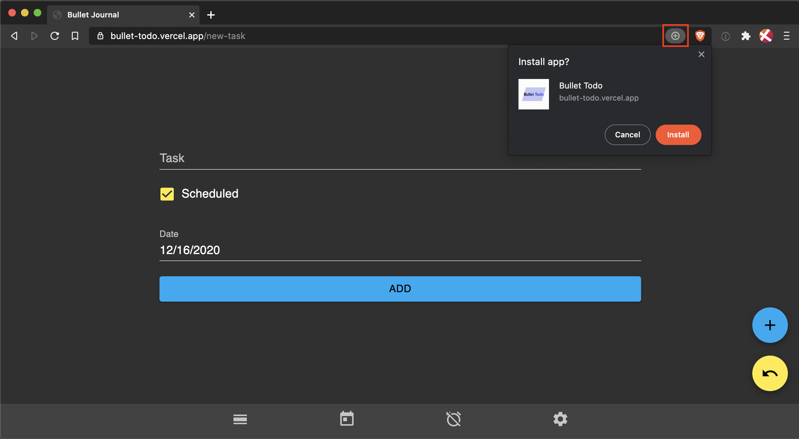
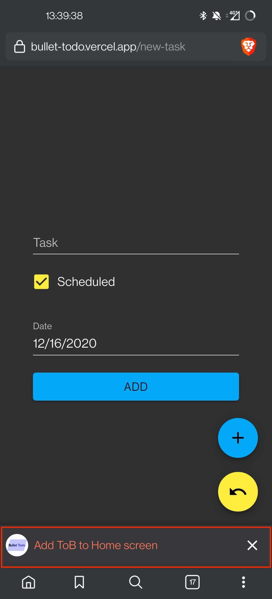

# Bullet Todo

An app to manage your tasks. The layout and functionality got inspired by a journal method called "Bullet Journal".

> [Check it out!](https://bullet-todo.vercel.app/new-task)

This app stores its data in the local storage at the moment. Thus, your changes will be persisted per device but can't be synced across platforms.

## Table of Contents

[Storybook](#storybook)

[PWA](#pwa)

<a name="storybook"/>

## Storybook

> [Latest Storybook](https://main--5fd9c9c498569c0021ebcc58.chromatic.com/)

<a name="pwa"/>

## PWA

This app is a Progressive Web App. Therefore you can add it as an app on a desktop or phone.

For it to work seamlessly, I recommend to use a browser based on Chromium.

On the desktop, you can add it via the plus button at the end of the url bar:

On mobile, there should appear a bar at the bottom to add it to the homescreen:

